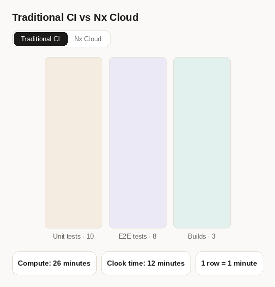
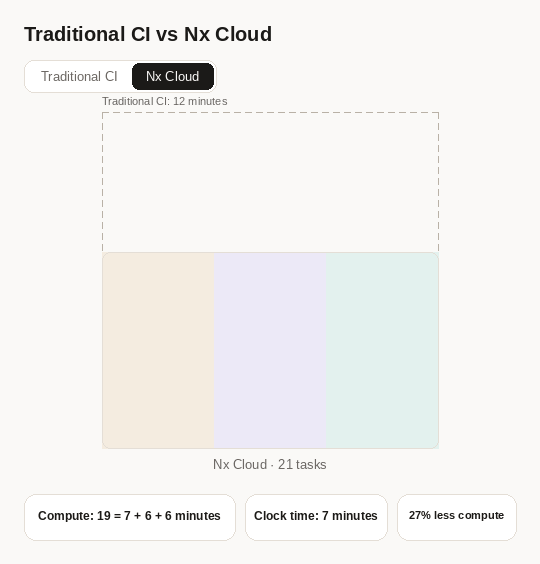

# Benchmark: Nx Cloud Platform on a Monolith

Most caching and distribution tools work at the level of projects. A monolith has one big
project, so a change anywhere invalidates everything, and every CI run redoes all the work.
This benchmark shows what the Nx Cloud platform does for that kind of repository, and explains
where the savings come from.

Across a realistic mix of pull requests, the platform verifies changes **11.7x faster** and
uses **4.6x less compute** than the same workspace running without it.

## The workspace

The repository is a synthetic but realistically shaped React monolith: one application,
`shop`, with all of its code in a single source tree (`apps/shop/src`). There are no
libraries. Code is organized by folder and imported file-to-file with relative paths.

|                        | Count |
| ---------------------- | ----- |
| Projects               | 1     |
| Features               | 300   |
| UI components          | 130   |
| Utilities              | 70    |
| Unit test (spec) files | 1,110 |
| E2E specs              | 100   |
| Lines of TypeScript    | ~300k |

## The tasks

A full CI run executes 1,214 tasks.

| Target    | Tasks | Notes                                             |
| --------- | ----- | ------------------------------------------------- |
| test-ci   | 1,110 | Vitest, one spec file per task                    |
| e2e-ci    | 100   | one Playwright spec per task                      |
| build     | 1     | the `shop` application                            |
| typecheck | 1     | the whole application                             |
| lint      | 1     | the whole application                             |
| validate  | 1     | simulates a CI check that is not project specific |

Without splitting, the same work is only 6 tasks. `shop:test` alone runs all 1,110 spec
files, and `shop:e2e` runs all 100 e2e specs.

Some tasks have to run in a particular order:

- The application must be built before e2e tests can run, because the tests exercise the
  built app through a preview server.
- E2E tests have to run one at a time, simulating a shared resource they all need.

## The three scenarios

Every measurement below covers the same three types of change:

- **Full rebuild**: a global change (`nx.json`), so every task reruns.
- **Large change**: a shared utility changes (`utils/format/format-currency`).
- **Feature change**: a single feature changes (`features/cart/list`, a typical pull
  request).

Two numbers are reported for each. **Verification time** is the wall-clock time a developer
waits. **Verification compute** is the total machine time consumed across every VM or agent,
which is what the run actually costs.

## Baseline: Nx without Nx Cloud

[nrwl/monolith-bench](https://github.com/nrwl/monolith-bench) is the same repository
without Nx Cloud: no remote cache, no Nx agents, no Ultracache and no distributed task
execution. It uses one VM per task type: build, typecheck, lint, test, e2e and validate.
Unit tests run as a single `shop:test` task with 4 Vitest workers, and e2e tests run one at
a time as a single `shop:e2e` task.

Because the whole repository is one project, even a perfect project-level cache would not
help: any change to the source tree invalidates `shop:test` and `shop:e2e`, so every scenario
reruns everything.

| Scenario       | Verification time | Verification compute |
| -------------- | ----------------- | -------------------- |
| Full rebuild   | 55m 7s            | 1h 43m 32s           |
| Large change   | 55m 7s            | 1h 43m 32s           |
| Feature change | 55m 7s            | 1h 43m 32s           |

Compute is the sum of the six VMs. The three scenarios cost the same, because every change
reruns everything. Verification time is set by the unit test VM.

## Nx Cloud

This repository runs the same workload through Nx Cloud on six `linux-large-js` agents
(`.nx/ci-config.yaml`), with tests split into one task per spec file.

| Scenario         | Verification time | Verification compute | vs baseline                    |
| ---------------- | ----------------- | -------------------- | ------------------------------ |
| Full rebuild     | 9m 58s            | 1h 2m 33s            | 5.5x faster, 40% less compute  |
| Large change     | 6m 5s             | 37m 48s              | 9.1x faster, 63% less compute  |
| Feature change   | 4m 12s            | 17m 47s              | 13.1x faster, 83% less compute |
| Weighted average | 4m 42s            | 22m 32s              | 11.7x faster, 78% less compute |

Compute is the main job plus its six agents. A typical feature pull request is verified in
about four minutes, instead of 55.

## Total compute

The overall saving depends on how often each kind of change occurs, and that ratio differs
between repositories. This comparison assumes 80% of CI executions are feature changes,
17% are large changes, and 3% are full rebuilds.

| Weighted average     | Baseline   | Nx Cloud |
| -------------------- | ---------- | -------- |
| Verification time    | 55m 7s     | 4m 42s   |
| Verification compute | 1h 43m 32s | 22m 32s  |

That is **11.7x faster** verification using **4.6x less compute** (a 78% reduction).

## How did we achieve this?

Two core mechanisms produce these savings:

- Ultracache
- Task distribution with dynamic compute packing

**Ultracache.** Nx Cloud instruments CI executions to learn what each task reads and
writes, down to every single file. In a monolith this is what makes caching work at all. A
conventional cache has to assume every task depends on the whole project, so every change
misses. Ultracache knows that `cart-list.spec.tsx` only reads a handful of files, so a change
to the cart list feature reruns 5 unit test files and 1 e2e spec, and everything else is a
cache hit. Combined with splitting tests into one task per spec file, it makes each test
independently cacheable. The cache configuration is also always correct, because it comes
from what tasks actually do rather than from what someone declared. Ultracache requires
Nx Cloud's task distribution.

**Task distribution with dynamic packing.** Nx Cloud learns how long each task takes and
what its CPU and RAM profile is. It understands critical paths and schedules work to
minimize wall-clock time. For instance, it can start the e2e tests that have to run one at a
time, then pack the rest of each VM with unit tests.

The core intuition is that you pay for VM minutes, not for how hard the VM works. As a
result, most CI executions either have low average CPU and RAM usage, often 20% of capacity,
or they run into out-of-memory errors and CPU throttling. That is what happens when you set
the parallelism flag by hand: you experiment with it until performance is decent and CI is
stable, and as the workspace evolves those settings go stale.

With Nx Cloud you set nothing. It knows what tasks run in what order, which tasks can coexist
on the same agent, and how much each one consumes, so it assigns work dynamically to keep VMs
near capacity, which means fewer VM minutes.

This is a viz illustrating traditional CI vs Nx Cloud:

Nx Cloud:

## What if my workspace is messy?

Both mechanisms help more in messy real-world workspaces than in a clean benchmark. In a
real monolith, tasks have tangled dependencies and very different CPU and RAM profiles, so a
hand-tuned parallelism setting has to account for the largest tasks in the set. Ultracache
still picks up exactly what each task reads, and Nx Cloud still partitions the work into
small units, runs them in the right order and packs VMs to their limits.

Because this benchmark is artificial and uniform (to make it easier to understand), that
messiness is not there, so the baseline performs better here than it would in practice.
